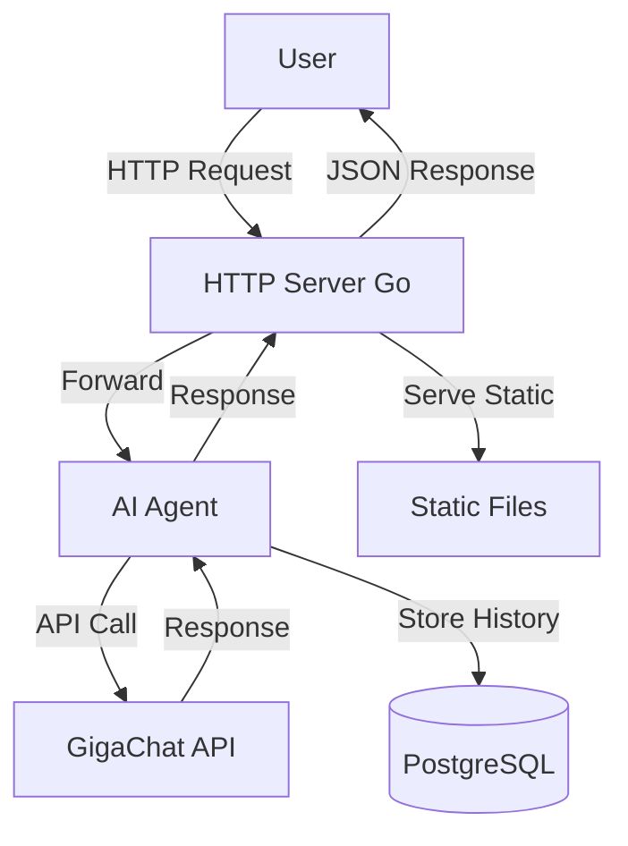
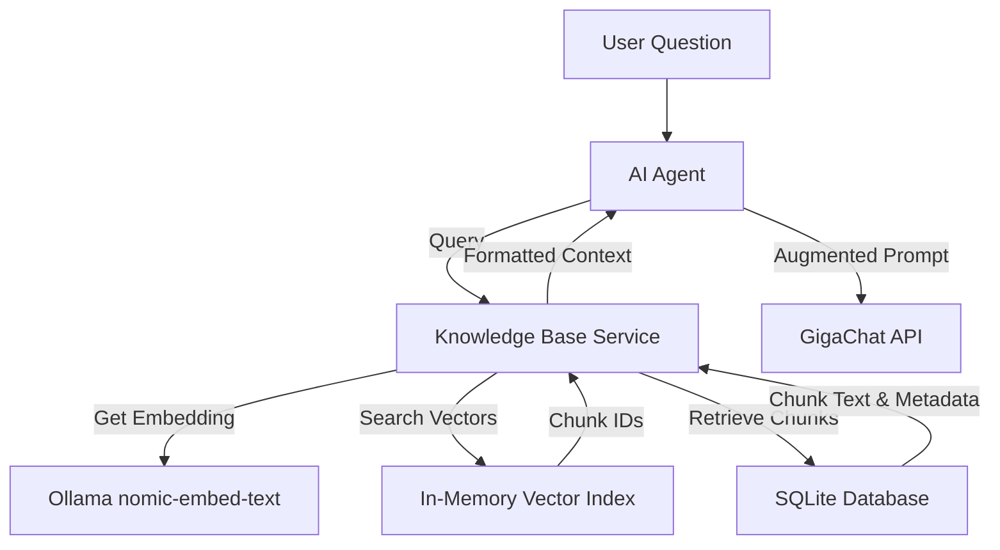

# AI Agent with Web Interface on Go + GigaChat

A client‑server application with an AI agent that interacts with GigaChat API. Provides a web interface for chatting, stores conversation history per session, and handles parallel requests.

## Features

- **Go backend** – HTTP server with routing, session management, and logging.
- **AI Agent** – Encapsulated logic for communicating with GigaChat API.
- **Web interface** – Modern, responsive UI with real‑time chat, landing page for session selection, and ability to load previous conversations.
- **Enhanced dialog creation** – Improved UI/UX for starting new chats, featuring a floating action button, visual feedback, and toast notifications.
- **Persistent storage** – PostgreSQL database for conversation history, surviving server restarts.
- **Session‑based history** – Full history per user with ability to load previous dialogs.
- **Multiple context management strategies** – Choose between `summary` (compress older messages), `sliding_window` (keep only recent messages), and `sticky_facts` (extract and reuse key facts across turns).
- **Finite State Machine (FSM) with LLM validation** – Automated task progression with validation of LLM responses against checklist criteria.
- **Automatic state switching** – Seamless transition between task states based on validation results.
- **Validation feedback integration** – LLM receives task context, instructions, and validation feedback for improved responses.
- **Maximum attempt limiting** – Configurable limits to prevent infinite loops in automatic request generation.
- **Knowledge Base Search** – Vector search over local documents using Ollama embeddings and cosine similarity.
- **Structured logging** – Detailed logs with millisecond precision.
- **Dockerized** – Easy deployment with Docker Compose (includes PostgreSQL and Ollama).
- **Database migration** – Automatic schema creation on first launch.
- **Unit & integration tests** – Test coverage for key components.

## Architecture



## LLM Response Validation and State Switching

The system now includes advanced Finite State Machine (FSM) capabilities with automated LLM response validation and state switching.

### Key Features

1. **Automated Validation Pipeline**:
   - LLM responses are validated against state-specific checklists
   - Three validation outcomes: `SUCCESS`, `FAILED`, `NEED_USER_ANSWER`
   - Special detection for "Нужна дополнительная информация" (needs user input)

2. **LLM-based Validation**:
   - Separate validation request to LLM with specialized prompt
   - Returns structured JSON with completion status, missing items, and feedback
   - Configurable validation prompt in `prompts/validation_prompt.md`

3. **State Management**:
   - Automatic state transitions based on validation results
   - Configurable `max_attempts` per state (global and per-state overrides)
   - Feedback storage in task context for iterative improvement

4. **Enhanced LLM Context**:
   - System prompts include: user's original task, current state instructions, validation feedback
   - Automatic inclusion of missing items from previous validation attempts

5. **Automatic Request Generation**:
   - After successful state transitions, system automatically generates next LLM request
   - Prevents infinite loops with configurable maximum attempt limits
   - Asynchronous processing to avoid blocking user interactions

### Configuration

FSM configuration is defined in `config/fsm.yaml`:

```yaml
fsm_config:
  initial_state: gathering_requirements
  max_attempts: 3  # Global maximum attempts
  validation_prompt_file: "prompts/validation_prompt.md"
  
  states:
    gathering_requirements:
      step_number: 1
      description: "Сбор вводных данных от пользователя"
      instructions: "Запроси у пользователя цель проекта, бюджет и дедлайн."
      max_attempts: 5  # Optional per-state override
      validation_schema:
        check_list:
          - "Цель сформулирована конкретно"
          - "Бюджет указан в числах"
          - "Дедлайн содержит дату или срок"
      on_success: market_analysis
      on_fail: gathering_requirements
```

### Validation Flow

1. User sends message → LLM generates response
2. Response saved to database and displayed to user
3. Validation process:
   - Check for "Нужна дополнительная информация" → `NEED_USER_ANSWER`
   - Send validation request to LLM with checklist and response
   - Parse validation result (`SUCCESS`/`FAILED`)
4. State transition:
   - `SUCCESS` → move to `on_success` state
   - `FAILED` → stay in current state (retry with feedback)
   - `NEED_USER_ANSWER` → wait for user input
5. If state changed and not in final state → automatic LLM request

### Environment Variables

- `FSM_CONFIG_PATH`: Path to FSM configuration file (default: `config/fsm.yaml`)
- `VALIDATION_PROMPT_FILE`: Path to validation prompt file (default: `prompts/validation_prompt.md`)

## Knowledge Base Search

The system now includes a knowledge base search feature that augments user questions with relevant context from a local document database.

### Overview

When a user sends a message, the system:
1. Generates an embedding vector for the query using Ollama (`nomic-embed-text` model)
2. Searches for similar chunks in the vector index (cosine similarity)
3. Retrieves the most relevant text chunks from SQLite database
4. Formats the context according to a predefined template
5. Prepends the context to the conversation as a system message

### Architecture



### Configuration

Enable the knowledge base by setting `KNOWLEDGE_BASE_ENABLED=true` in your environment.

| Environment Variable | Description | Default |
|----------------------|-------------|---------|
| `KNOWLEDGE_BASE_ENABLED` | Enable/disable knowledge base feature | `false` |
| `KNOWLEDGE_BASE_SQLITE_PATH` | Path to SQLite database file | `/app/data/knowledge.db` |
| `KNOWLEDGE_BASE_FAISS_PATH` | Path to FAISS index file (reserved for future use) | `/app/data/faiss.index` |
| `OLLAMA_HOST` | Ollama service URL | `http://ollama:11434` (Docker) |
| `OLLAMA_EMBEDDING_MODEL` | Embedding model name | `nomic-embed-text` |
| `KNOWLEDGE_BASE_K` | Number of nearest neighbors to retrieve | `5` |
| `KNOWLEDGE_BASE_RELEVANCE_THRESHOLD` | Maximum distance for relevant chunks (0.0‑1.0) | `0.8` |
| `KNOWLEDGE_BASE_MAX_CHUNKS` | Maximum chunks to include in context | `3` |

### Database Schema

The knowledge base uses a SQLite database with the following schema:

```sql
CREATE TABLE documents (
    id INTEGER PRIMARY KEY AUTOINCREMENT,
    file_path TEXT NOT NULL UNIQUE,
    file_hash TEXT NOT NULL,
    file_size INTEGER NOT NULL,
    modified_at TIMESTAMP NOT NULL,
    chunk_count INTEGER DEFAULT 0,
    indexed_at TIMESTAMP DEFAULT CURRENT_TIMESTAMP,
    created_at TIMESTAMP DEFAULT CURRENT_TIMESTAMP
);

CREATE TABLE chunks (
    id TEXT PRIMARY KEY,
    document_id INTEGER NOT NULL,
    text TEXT NOT NULL,
    section TEXT,
    chunk_index INTEGER NOT NULL,
    start_offset INTEGER NOT NULL,
    end_offset INTEGER NOT NULL,
    token_count INTEGER,
    created_at TIMESTAMP DEFAULT CURRENT_TIMESTAMP,
    FOREIGN KEY (document_id) REFERENCES documents(id) ON DELETE CASCADE
);

CREATE TABLE embeddings (
    chunk_id TEXT PRIMARY KEY,
    model TEXT NOT NULL,
    dimension INTEGER NOT NULL,
    vector_data BLOB NOT NULL,
    generated_at TIMESTAMP DEFAULT CURRENT_TIMESTAMP,
    FOREIGN KEY (chunk_id) REFERENCES chunks(id) ON DELETE CASCADE
);
```

### Context Format

The system formats retrieved chunks into the following structure:

```
Вопрос: [ТЕКСТ ВОПРОСА ПОЛЬЗОВАТЕЛЯ]

Контекст:
[ТЕКСТ ЧАНКА 1]
file_path: <имя файла из метаданных чанков>
section: <заголовок из метаданных чанков>
---
[ТЕКСТ ЧАНКА 2]
file_path: <имя файла из метаданных чанков>
section: <заголовок из метаданных чанков>
---
[ТЕКСТ ЧАНКА 3]
file_path: <имя файла из метаданных чанков>
section: <заголовок из метаданных чанков>
```

### Populating the Knowledge Base

An example script is provided at `scripts/populate_knowledge.go` to demonstrate how to:
1. Create the SQLite database with required schema
2. Chunk documents and store them in the database
3. Generate embeddings (dummy embeddings in the example)
4. Prepare the knowledge base for search

To use real embeddings, modify the script to call Ollama's embedding API.

## Quick Start

### Prerequisites

- Docker and Docker Compose
- GigaChat API key (from [SberCloud](https://developers.sber.ru/portal/products/gigachat))

### Deployment

1. Clone the repository:
   ```bash
   git clone <repository-url>
   cd ai-agent-gigachat
   ```

2. Create a `.env` file in the project root:
   ```bash
   echo "GIGACHAT_API_KEY=your_api_key_here" > .env
   echo "DB_PASSWORD=your_postgres_password_here" >> .env   # optional, defaults to 'postgres'
   ```

3. Start the application:
   ```bash
   docker-compose up --build
   ```

4. Open your browser at [http://localhost:8080](http://localhost:8080).

### Local Development

If you want to run the server locally without Docker:

1. Ensure Go 1.22+ is installed.
2. Set the environment variables:
   ```bash
   export GIGACHAT_API_KEY=your_api_key_here
   export DB_HOST=localhost
   export DB_PORT=5432
   export DB_USER=postgres
   export DB_PASSWORD=postgres
   export DB_NAME=ai_agent
   ```
3. Run a PostgreSQL instance (e.g., via Docker):
   ```bash
   docker run --name ai-agent-postgres -e POSTGRES_PASSWORD=postgres -e POSTGRES_DB=ai_agent -p 5432:5432 -d postgres:16-alpine
   ```
4. Run the server:
   ```bash
   go run ./cmd/server
   ```
5. The web interface will be available at `http://localhost:8080`.

## Project Structure

```
.
├── cmd/server/main.go          # Entry point
├── internal/agent/             # AI agent logic
├── internal/storage/           # Storage interface & implementations
├── internal/server/            # HTTP handlers & middleware
├── internal/logging/           # Structured logging
├── static/                     # Web interface (HTML, CSS, JS)
├── migrations/                 # SQL migration scripts
├── tests/                      # Unit and integration tests
├── Dockerfile
├── docker-compose.yml
├── go.mod
└── README.md
```

## Database Persistence

The application uses PostgreSQL to store conversation history. Each session and its messages are saved in the database, allowing history to survive server restarts.

### Schema

- **sessions** – stores session metadata (id, created_at, updated_at).
- **messages** – stores individual messages (id, session_id, role, content, created_at, sequence).

Migrations are applied automatically on startup via `CREATE TABLE IF NOT EXISTS`.

### Context Management Strategies

The agent supports multiple strategies for managing conversation history, configurable per session via the `strategy` parameter.

#### Summary (default)
When the number of messages exceeds `HISTORY_MAX_MESSAGES`, older messages are automatically summarized into a single system message.

- **Configuration**: Set `HISTORY_MAX_MESSAGES` (integer) to the maximum number of messages allowed per session. If set to 0 (default), compression is disabled.
- **Summarization prompt**: Provide a custom prompt via a file specified in `HISTORY_SUMMARY_PROMPT_FILE`. If not set, a default prompt is used.
- **Behavior**: When a new user message would cause the history to exceed the limit, the agent summarizes all older messages (excluding the current user message) into a single summary message (role `system`). The summary replaces the older messages, and a notification message is added. The conversation continues with the summary as context.
- **Notification**: A system message "History has been summarized to reduce length." appears in the chat UI.

#### Sliding Window
Keeps only the most recent N messages, discarding older ones.

- **Configuration**: Set `SLIDING_WINDOW_SIZE` (default 10) to the number of messages to retain.
- **Behavior**: Before each request, the agent truncates the session history to the last `SLIDING_WINDOW_SIZE` messages. No extra LLM call is required.

#### Sticky Facts
Maintains a sliding window of recent messages and extracts key facts from the conversation, which are sent as a system message at the start of each request. Facts are updated after each turn.

- **Configuration**:
  - `STICKY_FACTS_WINDOW_SIZE` (default 10) – number of recent messages to keep.
  - `STICKY_FACTS_EXTRACTION_PROMPT_FILE` – path to a custom prompt for fact extraction (default prompt extracts facts as JSON).
- **Behavior**:
  1. The agent keeps the last `STICKY_FACTS_WINDOW_SIZE` messages.
  2. Before sending the request, a system message containing the current facts (key‑value pairs) is prepended to the conversation.
  3. After receiving the assistant's response, the agent runs fact extraction on the updated conversation (including the new messages) and updates the session's facts store.
  4. Facts are persisted across requests and can evolve as the conversation progresses.

### Storage Interface

The agent uses a pluggable storage interface (`storage.Storage`). Two implementations are provided:

- **PostgreSQL** – production storage with full persistence.
- **In‑memory** – used for testing and as a fallback when no database is configured.

### Environment Variables

| Environment Variable | Description                         | Required | Default          |
|----------------------|-------------------------------------|----------|------------------|
| `GIGACHAT_API_KEY`   | Bearer token for GigaChat API       | Yes      | –                |
| `DB_HOST`            | PostgreSQL host                     | No       | `postgres`       |
| `DB_PORT`            | PostgreSQL port                     | No       | `5432`           |
| `DB_USER`            | PostgreSQL user                     | No       | `postgres`       |
| `DB_PASSWORD`        | PostgreSQL password                 | No       | `postgres`       |
| `DB_NAME`            | PostgreSQL database name            | No       | `ai_agent`       |
| `HISTORY_MAX_MESSAGES` | Maximum number of messages per session before compression triggers (0 = disabled) | No | 0 |
| `HISTORY_SUMMARY_PROMPT_FILE` | Path to a file containing a custom summarization prompt | No | (uses default prompt) |
| `SLIDING_WINDOW_SIZE` | Number of most recent messages to keep when using `sliding_window` strategy | No | 10 |
| `STICKY_FACTS_WINDOW_SIZE` | Number of most recent messages to keep when using `sticky_facts` strategy | No | 10 |
| `STICKY_FACTS_EXTRACTION_PROMPT_FILE` | Path to a file containing a custom prompt for fact extraction | No | (uses default prompt) |
| `KNOWLEDGE_BASE_ENABLED` | Enable/disable knowledge base search feature | No | `false` |
| `KNOWLEDGE_BASE_SQLITE_PATH` | Path to SQLite knowledge base database | No | `/app/data/knowledge.db` |
| `KNOWLEDGE_BASE_FAISS_PATH` | Path to FAISS index file (reserved for future use) | No | `/app/data/faiss.index` |
| `OLLAMA_HOST` | Ollama service URL for embeddings | No | `http://ollama:11434` (Docker) |
| `OLLAMA_EMBEDDING_MODEL` | Embedding model name | No | `nomic-embed-text` |
| `KNOWLEDGE_BASE_K` | Number of nearest neighbors to retrieve | No | `5` |
| `KNOWLEDGE_BASE_RELEVANCE_THRESHOLD` | Maximum distance for relevant chunks (0.0‑1.0) | No | `0.8` |
| `KNOWLEDGE_BASE_MAX_CHUNKS` | Maximum chunks to include in context | No | `3` |

When running with Docker Compose, all database variables are set automatically; you only need to provide `DB_PASSWORD` if you wish to change it.

## API Reference

See [API.md](API.md) for detailed endpoint documentation, request/response formats, and error codes.

## Logging

Logs are printed to stdout in the following format:

```
[2026-03-23 21:26:46.123] INFO Server started on :8080
[2026-03-23 21:27:01.456] HTTP_REQUEST POST /api/chat ...
[2026-03-23 21:27:02.789] GIGACHAT_REQUEST URL: https://... ...
[2026-03-23 21:27:03.012] GIGACHAT_RESPONSE Status: 200 ...
[2026-03-23 21:27:03.015] HTTP_RESPONSE 200 ...
```

## Testing

Run the test suite:

```bash
go test ./...
```

- Unit tests cover agent, session, storage, and logging.
- Integration tests simulate HTTP requests and verify end‑to‑end flow with a real database (using test containers).

## License

MIT