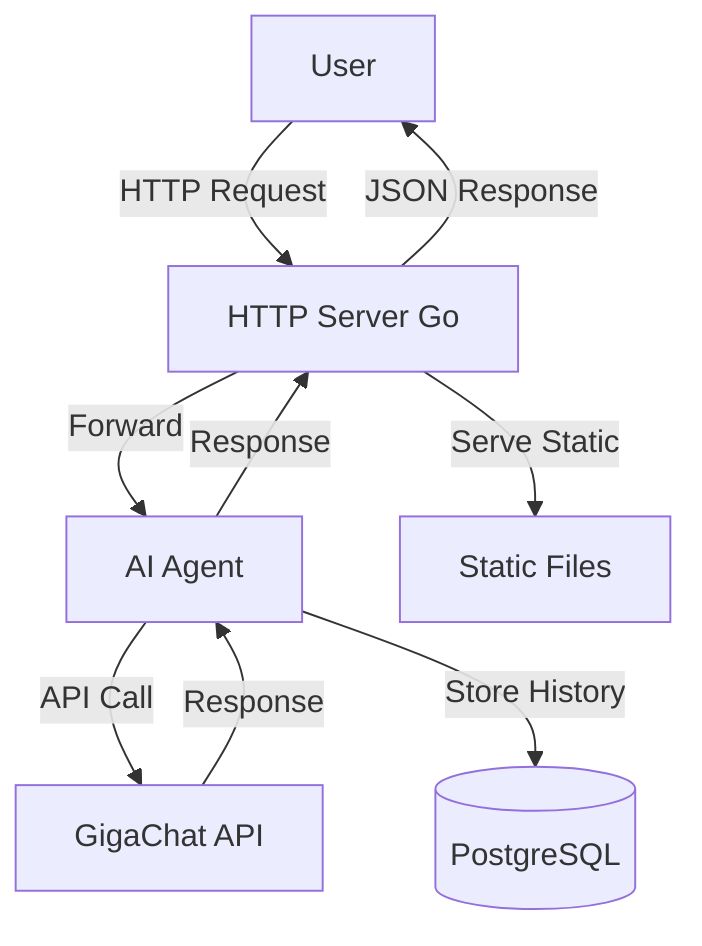

# AI Agent with Web Interface on Go + GigaChat

A client‑server application with an AI agent that interacts with GigaChat API. Provides a web interface for chatting, stores conversation history per session, and handles parallel requests.

## Features

- **Go backend** – HTTP server with routing, session management, and logging.
- **AI Agent** – Encapsulated logic for communicating with GigaChat API.
- **Web interface** – Modern, responsive UI with real‑time chat, landing page for session selection, and ability to load previous conversations.
- **Enhanced dialog creation** – Improved UI/UX for starting new chats, featuring a floating action button, visual feedback, and toast notifications.
- **Persistent storage** – PostgreSQL database for conversation history, surviving server restarts.
- **Session‑based history** – Full history per user with ability to load previous dialogs.
- **Structured logging** – Detailed logs with millisecond precision.
- **Dockerized** – Easy deployment with Docker Compose (includes PostgreSQL).
- **Database migration** – Automatic schema creation on first launch.
- **Unit & integration tests** – Test coverage for key components.

## Architecture



## Quick Start

### Prerequisites

- Docker and Docker Compose
- GigaChat API key (from [SberCloud](https://developers.sber.ru/portal/products/gigachat))

### Deployment

1. Clone the repository:
   ```bash
   git clone <repository-url>
   cd ai-agent-gigachat
   ```

2. Create a `.env` file in the project root:
   ```bash
   echo "GIGACHAT_API_KEY=your_api_key_here" > .env
   echo "DB_PASSWORD=your_postgres_password_here" >> .env   # optional, defaults to 'postgres'
   ```

3. Start the application:
   ```bash
   docker-compose up --build
   ```

4. Open your browser at [http://localhost:8080](http://localhost:8080).

### Local Development

If you want to run the server locally without Docker:

1. Ensure Go 1.22+ is installed.
2. Set the environment variables:
   ```bash
   export GIGACHAT_API_KEY=your_api_key_here
   export DB_HOST=localhost
   export DB_PORT=5432
   export DB_USER=postgres
   export DB_PASSWORD=postgres
   export DB_NAME=ai_agent
   ```
3. Run a PostgreSQL instance (e.g., via Docker):
   ```bash
   docker run --name ai-agent-postgres -e POSTGRES_PASSWORD=postgres -e POSTGRES_DB=ai_agent -p 5432:5432 -d postgres:16-alpine
   ```
4. Run the server:
   ```bash
   go run ./cmd/server
   ```
5. The web interface will be available at `http://localhost:8080`.

## Project Structure

```
.
├── cmd/server/main.go          # Entry point
├── internal/agent/             # AI agent logic
├── internal/storage/           # Storage interface & implementations
├── internal/server/            # HTTP handlers & middleware
├── internal/logging/           # Structured logging
├── static/                     # Web interface (HTML, CSS, JS)
├── migrations/                 # SQL migration scripts
├── tests/                      # Unit and integration tests
├── Dockerfile
├── docker-compose.yml
├── go.mod
└── README.md
```

## Database Persistence

The application uses PostgreSQL to store conversation history. Each session and its messages are saved in the database, allowing history to survive server restarts.

### Schema

- **sessions** – stores session metadata (id, created_at, updated_at).
- **messages** – stores individual messages (id, session_id, role, content, created_at, sequence).

Migrations are applied automatically on startup via `CREATE TABLE IF NOT EXISTS`.

### Storage Interface

The agent uses a pluggable storage interface (`storage.Storage`). Two implementations are provided:

- **PostgreSQL** – production storage with full persistence.
- **In‑memory** – used for testing and as a fallback when no database is configured.

### Environment Variables

| Environment Variable | Description                         | Required | Default          |
|----------------------|-------------------------------------|----------|------------------|
| `GIGACHAT_API_KEY`   | Bearer token for GigaChat API       | Yes      | –                |
| `DB_HOST`            | PostgreSQL host                     | No       | `postgres`       |
| `DB_PORT`            | PostgreSQL port                     | No       | `5432`           |
| `DB_USER`            | PostgreSQL user                     | No       | `postgres`       |
| `DB_PASSWORD`        | PostgreSQL password                 | No       | `postgres`       |
| `DB_NAME`            | PostgreSQL database name            | No       | `ai_agent`       |

When running with Docker Compose, all database variables are set automatically; you only need to provide `DB_PASSWORD` if you wish to change it.

## API Reference

See [API.md](API.md) for detailed endpoint documentation, request/response formats, and error codes.

## Logging

Logs are printed to stdout in the following format:

```
[2026-03-23 21:26:46.123] INFO Server started on :8080
[2026-03-23 21:27:01.456] HTTP_REQUEST POST /api/chat ...
[2026-03-23 21:27:02.789] GIGACHAT_REQUEST URL: https://... ...
[2026-03-23 21:27:03.012] GIGACHAT_RESPONSE Status: 200 ...
[2026-03-23 21:27:03.015] HTTP_RESPONSE 200 ...
```

## Testing

Run the test suite:

```bash
go test ./...
```

- Unit tests cover agent, session, storage, and logging.
- Integration tests simulate HTTP requests and verify end‑to‑end flow with a real database (using test containers).

## License

MIT