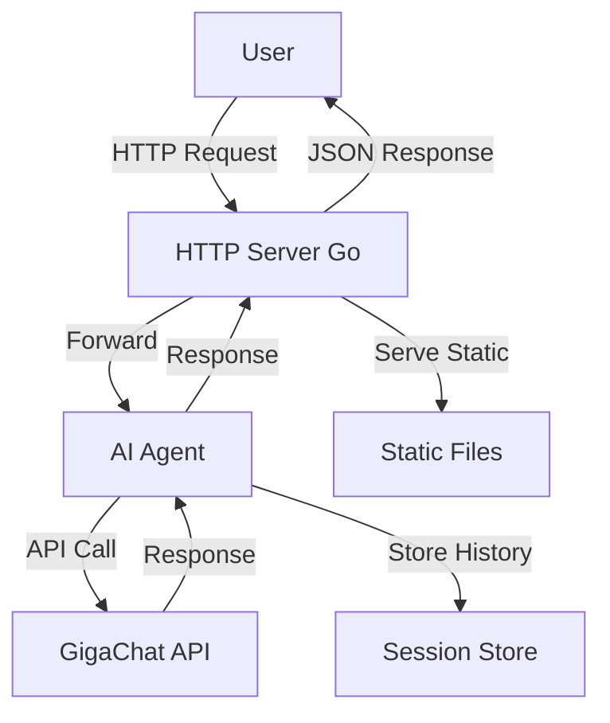

# AI Agent with Web Interface on Go + GigaChat

A client‑server application with an AI agent that interacts with GigaChat API. Provides a web interface for chatting, stores conversation history per session, and handles parallel requests.

## Features

- **Go backend** – HTTP server with routing, session management, and logging.
- **AI Agent** – Encapsulated logic for communicating with GigaChat API.
- **Web interface** – Modern, responsive UI with real‑time chat.
- **Session‑based history** – In‑memory storage of conversation history per user.
- **Structured logging** – Detailed logs with millisecond precision.
- **Dockerized** – Easy deployment with Docker Compose.
- **Unit & integration tests** – Test coverage for key components.

## Architecture



## Quick Start

### Prerequisites

- Docker and Docker Compose
- GigaChat API key (from [SberCloud](https://developers.sber.ru/portal/products/gigachat))

### Deployment

1. Clone the repository:
   ```bash
   git clone <repository-url>
   cd ai-agent-gigachat
   ```

2. Create a `.env` file in the project root:
   ```bash
   echo "GIGACHAT_API_KEY=your_api_key_here" > .env
   ```

3. Start the application:
   ```bash
   docker-compose up --build
   ```

4. Open your browser at [http://localhost:8080](http://localhost:8080).

### Local Development

If you want to run the server locally without Docker:

1. Ensure Go 1.22+ is installed.
2. Set the environment variable:
   ```bash
   export GIGACHAT_API_KEY=your_api_key_here
   ```
3. Run the server:
   ```bash
   go run ./cmd/server
   ```
4. The web interface will be available at `http://localhost:8080`.

## Project Structure

```
.
├── cmd/server/main.go          # Entry point
├── internal/agent/             # AI agent logic
├── internal/server/            # HTTP handlers & middleware
├── internal/logging/           # Structured logging
├── static/                     # Web interface (HTML, CSS, JS)
├── tests/                      # Unit and integration tests
├── Dockerfile
├── docker-compose.yml
├── go.mod
└── README.md
```

## API Reference

See [API.md](API.md) for detailed endpoint documentation, request/response formats, and error codes.

## Logging

Logs are printed to stdout in the following format:

```
[2026-03-23 21:26:46.123] INFO Server started on :8080
[2026-03-23 21:27:01.456] HTTP_REQUEST POST /api/chat ...
[2026-03-23 21:27:02.789] GIGACHAT_REQUEST URL: https://... ...
[2026-03-23 21:27:03.012] GIGACHAT_RESPONSE Status: 200 ...
[2026-03-23 21:27:03.015] HTTP_RESPONSE 200 ...
```

## Testing

Run the test suite:

```bash
go test ./...
```

- Unit tests cover agent, session, and logging.
- Integration tests simulate HTTP requests and verify end‑to‑end flow.

## Configuration

| Environment Variable | Description                         | Required |
|----------------------|-------------------------------------|----------|
| `GIGACHAT_API_KEY`   | Bearer token for GigaChat API       | Yes      |

## License

MIT